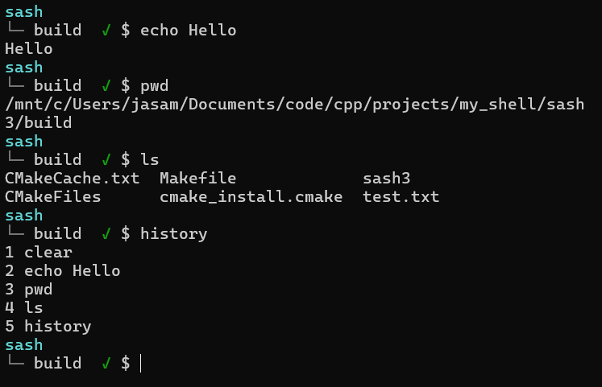
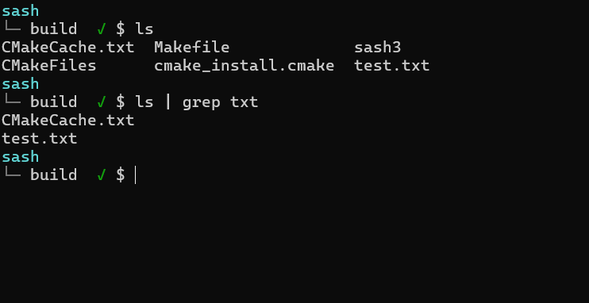
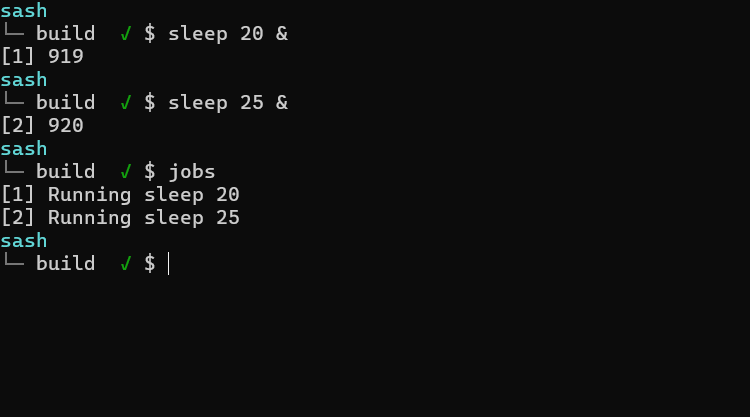
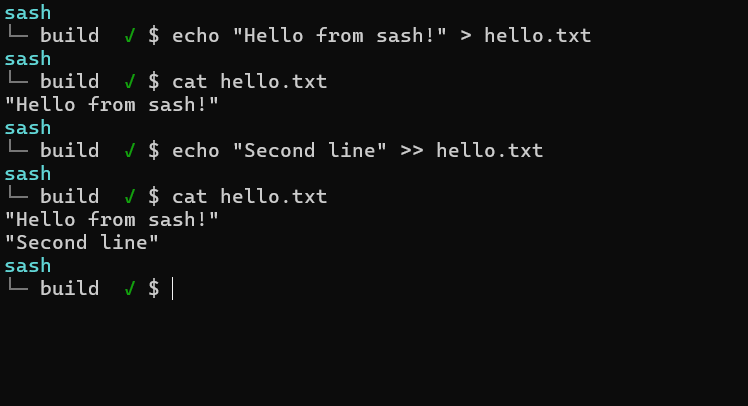

# sash3
A Unix-like shell written in Modern C++(C++23) for learning Linux systems programming, process management, and operating system concepts.

   
---
## Overview
`sash3` is a personal systems programming project that recreates core features of a Unix shell using low-level POSIX system calls.

The project implements:

- Process creation (`fork`, `execvp`, `waitpid`)
- Pipes and I/O redirection
- Background and foreground job control
- Unix signal handling
- Command history
- Built-in shell commands

The primary goal of the project is to gain hands-on experience with Linux internals and modern C++ by building a shell from scratch instead of relying on existing libraries.
Current implementation includes:

- Command execution
- Built-in commands
- Input/Output redirection
- Multi-stage pipelines
- Background jobs
- Unix job control
- Process groups
- Signal handling
- `jobs`, `fg`, and `bg` builtins
- Command history (in progress)

The project is intentionally designed as a modular monolith with each subsystem isolated into its own component.

## Features

### Shell

- Interactive shell prompt
- Exit status indicator
- Built-in commands
- Command parsing

### Process Execution

- Execute external programs using `fork()` and `execvp()`
- Wait for child processes using `waitpid()`
- Proper exit status handling

### Redirection

- Input redirection (`<`)
- Output redirection (`>`)
- Append redirection (`>>`)

### Pipelines

- Multi-stage pipelines using `pipe()`
- Arbitrary pipeline length

Usage:

```bash
cat file.txt | grep hello | sort | uniq
```

### Job Control

- Background execution (`&`)
- `jobs`
- `fg`
- `bg`
- Stopped jobs (`Ctrl+Z`)
- Foreground process groups (tcsetpgrp)
- Background process groups

### Signals

- SIGINT (Ctrl+C)
- SIGTSTP (Ctrl+Z)
- SIGCONT
- Zombie cleanup using `waitpid(..., WNOHANG)`

### History

- Command history (currently being implemented)

## Architecture

```
               +------------------+
               |      Shell       |
               +------------------+
                        |
        +---------------+--------------+
        |                              |
      Lexer                        Builtins
        |
      Parser
        |
     Pipeline
        |
     Executor
        |
 +------+--------+
 |               |
Jobs         Linux Kernel
```

Each module has a single responsibility.

| Module | Responsibility |
|---------|----------------|
| Shell | Main loop |
| Lexer | Tokenization |
| Parser | Parse commands |
| Pipeline | Pipeline representation |
| Executor | Execute commands |
| Jobs | Background job management |
| Builtins | cd, exit, jobs, fg, bg |

## Directory Structure

```
sash3/
├── include/
├── src/
├── docs/
├── tests/
├── scripts/
├── CMakeLists.txt
└── README.md
```

## Screenshots

<table>
<tr>
<td align="center">
<b>Prompt</b><br>

</td>

<td align="center">
<b>Pipeline</b><br>

</td>
</tr>

<tr>
<td align="center">
<b>Job Control</b><br>

</td>

<td align="center">
<b>Redirection</b><br>

</td>
</tr>
</table>

## Build

Clone the repository.

```bash
git clone <repo-url>
cd sash3
```

Configure.

```bash
cmake -S . -B build
```

Build.

```bash
cmake --build build
```

Run.

```bash
./build/sash3
```
## Usage

```bash
sash
└─ build ✓ $ echo Hello, World!
Hello, World!

sash
└─ build ✓ $ pwd
/home/user/sash3/build

sash
└─ build ✓ $ ls | grep cpp

sash
└─ build ✓ $ echo "hello" > test.txt

sash
└─ build ✓ $ cat test.txt
hello

sash
└─ build ✓ $ sleep 30 &

[1] 12345

sash
└─ build ✓ $ jobs

[1] Running sleep 30

sash
└─ build ✓ $ history

1 echo Hello, World!
2 pwd
3 ls | grep cpp
4 echo "hello" > test.txt
5 cat test.txt
6 sleep 30 &
7 jobs
```
## Learning Objectives

This project was built to gain practical experience with:

- Linux system calls
- fork()
- execvp()
- waitpid()
- process groups
- signals
- pipes
- file descriptors
- terminal control
- Modern C++23
- CMake
- modular software architecture


## Current Roadmap

Completed

- ✅ Prompt
- ✅ Lexer
- ✅ Parser
- ✅ External command execution
- ✅ Builtins
- ✅ Redirection
- ✅ Pipelines
- ✅ Background jobs
- ✅ Job control
- ✅ fg
- ✅ bg
- ✅ jobs

In Progress

- 🚧 Command history

Planned

- ⬜ Persistent history
- ⬜ Tab completion
- ⬜ Arrow-key line editing
- ⬜ Environment variables
- ⬜ Aliases
- ⬜ Configuration file
- ⬜ Unit tests
- ⬜ Wildcard expansion (*)

## Acknowledgements

This project was inspired by Unix shell design and built while studying Linux systems programming.
## License

This project is licensed under the MIT License. See the LICENSE file for details.
